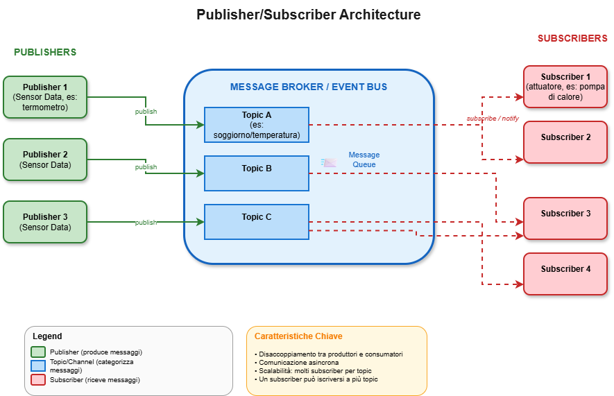

# Architettura

La scelta di un'architettura Publisher/Subscriber è stata dettata dalla necessità di gestire in modo efficiente la comunicazione tra i numerosi dispositivi del sistema domotico, evitando una degradazione delle performance dovuta, ad esempio, a continui polling.
Questa architettura consente di disaccoppiare completamente i client: 
- i sensori (publisher) pubblicano le proprie rilevazioni su topic specifici (es. soggiorno/temperatura, cucina/luminosità),
- gli attuatori (subscriber) ricevono notifiche solo per i topic a cui sono iscritti. Tale disaccoppiamento comporta diversi vantaggi nel contesto del nostro progetto:

**Scalabilità**: l'aggiunta di nuovi dispositivi non richiede modifiche agli altri componenti del sistema; è sufficiente che il nuovo device pubblichi o si iscriva ai topic appropriati.
**Flessibilità nella gestione degli scenari**: gli scenari personalizzati possono essere implementati come subscriber che reagiscono a combinazioni di eventi provenienti da più sensori, attivando di conseguenza gli attuatori coinvolti.
**Comunicazione event-driven**: il sistema reagisce agli eventi in tempo reale, senza la latenza e l'overhead introdotti da meccanismi di polling periodico.
**Manutenibilità**: la separazione netta tra produttori e consumatori di messaggi facilita lo sviluppo indipendente dei vari moduli e semplifica il testing.

