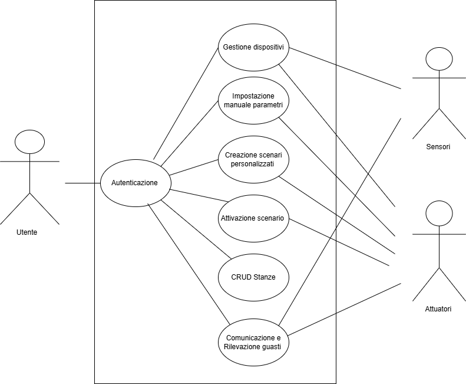

## **Use Case UC1: Gestione dispositivi**

*Scope*: Progetto Smart DAB  
*Level*: Utente  
*Primary actor*: Utente  
**Stakeholders and interests:**

* Utente: Vuole inserire un nuovo dispositivo nella sua smart home  
* Produttore: Vende il dispositivo compatibile con il sistema all'utente

**Preconditions:**  
Il sistema deve essere avviato per la prima volta e devono essere state create delle stanze.

**Postconditions:**  
Una volta che il dispositivo è stato registrato correttamente, verrà poi inserito all’interno della base di dati apposita.

**Main Success Scenario:**

*Flusso di configurazione:*

1. L’utente si reca ad un hub e si autentica con il PIN  
2. L’utente apre la finestra per l’inserimento del dispositivo.  
3. L’utente inserisce il nome del dispositivo, il tipo e la stanza in cui è installato.  
4. L’utente invia la richiesta di inserimento al sistema.  
5. Il sistema accetta il dispositivo.  
6. Il sistema effettua una prima comunicazione tra event bus e  il communicator del dispositivo per iniziare la corrispondenza.  
7. Il dispositivo risponde correttamente.  
8. L’event bus riceve la conferma della richiesta da parte dell’hub e la restituisce all’hub.  
9. Il sistema lo inserisce nella base di dati.  
10. Il dispositivo è pronto per ricevere istruzioni.

*Flusso di eliminazione:*

1. L’utente si reca ad un hub e si autentica con il PIN  
2. L’utente apre la finestra per l’inserimento del dispositivo.  
3. L’utente clicca sul dispositivo nella lista dei dispositivi presenti nel sistema.  
4. L’utente clicca il pulsante “elimina”.  
5. Il sistema inserisce lo stato di “inattivo” al dispositivo nella base di dati.

**Alternative Flows:**

*Flusso alternativo 1:*

1. L’utente si reca ad un hub si autentica con il PIN  
2. L’utente apre la finestra per l’inserimento del dispositivo.  
3. L’utente inserisce il nome di un dispositivo già esistente.  
4. L’utente invia la richiesta di inserimento al sistema .  
5. Il sistema invia un messaggio d’errore con il seguente testo: “Il dispositivo inserito è già esistente”.

**Frequency of Occurrence:** Potrebbe essere frequente all’inizio, ma poi avverrà con                                             			          frequenza minore

**Open Issues:**

## **Use Case UC2: Impostazione manuale parametri**

*Scope*: Progetto Smart DAB  
*Level*: Utente  
*Primary actor*: Utente  
**Stakeholders and interests:**

* Utente: vuole gestire velocemente e facilmente l’impostazione degli attuatori 

**Preconditions:**  
L’utente deve essersi autenticato. Devono esserci le stanze e i dispositivi che appartengono a quella stanza 

**Postconditions:**   
Il nuovo valore per quel l'attuatore sovrascrive il valore precedente. Il cambio del parametro è salvato nel database. 

**Main Success Scenario:** 

1. L'utente accede al pannello di controllo di un hub.  
2. L'utente seleziona la stanza di interesse (se ha effettuato l’accesso con il PIN)  
3. Il sistema mostra i parametri modificabili per quella stanza basandosi sui dispositivi installati   
4. L'utente seleziona un parametro e ne imposta il valore desiderato (tramite incremento, decremento o valore specifico).  
5. Il sistema richiede la conferma della modifica all'utente.  
6. L'utente conferma l'operazione.  
7. Il sistema invia il comando al dispositivo idoneo, aggiorna l'interfaccia e registra l'azione nello storico. 

## **Use case UC3: Creazione scenari personalizzati** 

*Scope*: Progetto Smart DAB  
*Level*: Utente  
*Primary actor*: Utente  
**Stakeholders and interests:**

* Utente: vuole creare uno scenario personalizzato per automatizzare le impostazioni di una o più stanze.

**Preconditions:** L'utente deve essersi autenticato con il PIN. Devono esistere stanze con dispositivi configurati.

**Postconditions:** Lo scenario è salvato nel database del sistema ed è disponibile per l'attivazione.

**Main Success Scenario:**

1. L'utente accede alla sezione per la gestione degli scenari e richiede la creazione di un nuovo scenario.  
2. L'utente assegna un nome univoco allo scenario.  
3. L'utente seleziona una stanza e un parametro (es. temperatura, illuminazione).
4. Il sistema permette solo l'inserimento dei valori ammessi per quel parametro.
5. L'utente imposta il valore desiderato per quel parametro in quella stanza.
6. *L'utente ripete i passi 3-5 per aggiungere ulteriori configurazioni.  
7. L'utente conferma il salvataggio dello scenario.  
8. Il sistema valida che non vi siano conflitti logici tra le configurazioni impostate (es. riscaldamento ON e condizionamento ON nella stessa stanza). 
9. Il sistema salva lo scenario nel database e conferma l'avvenuta creazione. 

## **Use Case UC4: Attivazione scenario** 

*Scope*: Progetto Smart DAB  
*Level*: Utente  
*Primary actor*: Utente
**Stakeholders and interests:**

* Utente: vuole attivare rapidamente una configurazione della casa senza impostare ogni dispositivo singolarmente.

**Preconditions:** Esiste almeno uno scenario configurato nel sistema.

**Postconditions:** I dispositivi fisici hanno cambiato stato secondo i parametri dello scenario. Eventuali impostazioni manuali precedenti sono sovrascritte.

**Main Success Scenario:**

1. L'utente visualizza la lista degli scenari disponibili sull'Hub.  
2. L'utente seleziona e attiva uno specifico scenario.  
3. Il sistema verifica la disponibilità/connessione dei dispositivi coinvolti.  
4. Il sistema invia i comandi ai dispositivi   
5. Il sistema aggiorna l'interfaccia utente mostrando il nuovo stato della casa.

**Extensions (Alternative Flows):**

* *4a. Un dispositivo dello scenario non risponde o è guasto:*  
  1. Il sistema rileva il dispositivo guasto.   
  2. Il sistema esegue comunque i comandi sugli altri dispositivi funzionanti.  
  3. Il sistema invia una notifica di "attivazione parziale" o malfunzionamento all'utente

## **Use Case UC5: CRUD Stanze**

Scope: Progetto Smart DAB  
Level: Utente   
Primary actor: Utente  
**Stakeholders and interests**:  
Utente: Vuole creare una nuova stanza, modificare o eliminare una stanza esistente.

**Preconditions**:   
L’utente ha avviato il sistema e ha effettuato la procedura di autenticazione.

**Postconditions**:  
L’interfaccia mostra la lista delle stanze aggiornata.

**Main Success Scenario**:

Creazione Stanza:

1. L’utente, tramite l’interfaccia dell’hub, seleziona l’opzione “Crea nuova stanza”.   
2. Il sistema richiede l’inserimento del nome della stanza.  
3. L’utente inserisce il nome della stanza e conferma.  
4. Se il nome è valido e univoco, il sistema aggiunge la stanza.  
5. Il sistema aggiorna la lista delle stanze. 

Modifica Stanza:

1. L’utente, tramite l’interfaccia dell’hub, seleziona una stanza esistente e sceglie l’opzione “Modifica”.  
2. Il sistema richiede il nuovo nome da attribuire alla stanza.  
3. L’utente inserisce il nuovo nome della stanza.  
4. Se il nome è univoco, il sistema aggiorna la stanza.  
5. Il sistema mostra la versione aggiornata delle stanze.

Eliminazione stanza:

1. L’utente, tramite l’interfaccia dell’hub, seleziona una stanza e sceglie “Elimina”.  
2. Il sistema verifica se la stanza contiene dispositivi.  
3. Se la stanza non contiene dispositivi, il sistema elimina la stanza.  
4. Il sistema aggiorna la lista delle stanze.

Alternative Flows:

Flusso alternativo 1:

1. L’utente, tramite l’interfaccia dell’hub, inserisce un nome già assegnato ad un’altra stanza.  
2. Il sistema rileva che il nome inserito non è univoco.  
3. Il sistema visualizza un messaggio di errore: “Nome già utilizzato”.  
4. Il sistema richiede all’utente di inserire un nuovo nome valido.

Flusso alternativo 2:

1. L’utente, tramite l’interfaccia dell’hub, seleziona l’opzione “Eliminazione stanza”.  
2. Il sistema rileva la presenza di uno o più dispositivi associati alla stanza selezionata.  
3. Il sistema informa l’utente che la stanza contiene dispositivi.  
4. Il sistema richiede all’utente di rimuovere i dispositivi presenti prima di procedere con l’eliminazione della stanza.  
5. Il flusso termina senza eliminare la stanza. 

## **Use Case UC6: Comunicazioni e Rilevazione di guasti**

*Scope*: Progetto Smart DAB  
*Level*: Sistema  
*Primary actor*: Dispositivi

**Preconditions:**  
I dispositivi devono essere opportunamente configurati e connessi al sistema e quest’ultimo deve essere stato avviato per la prima volta definendo le stanze. Ogni dispositivo deve essere compatibile e dunque munito di un apposito communicator e command dispatcher.

**Postconditions:**      
I dispositivi hanno inviato o ricevuto con successo le informazioni dall’event bus. Qualora un dispositivo non funzioni correttamente viene rilevato e segnalato dal sistema.

**Main Success Scenario:**

*Flusso di comunicazione Sensore-Attuatore:*

1. Sensore A invia la sua misura all’event bus seguendo uno standard specifico  
2. Event bus riceve l’evento  
3. Event bus fa corrispondere all’evento uno specifico topic preesistente  
4. Event bus invia l’evento all’hub centrale e invia la richiesta agli attuatori iscritti al topic  
5. I Command dispatcher dei vari attuatori ricevono la richiesta  
6. Command dispatcher elabora il segnale per renderlo comprensibile all’attuatore  
7. Attuatore riceve la richiesta e si attiva  
8. Communicator manda all’event bus una conferma  
9. Tutti gli attuatori rispondono e la comunicazione va a buon fine

*Flusso di comunicazione Hub-Dispositivo:*

1. Hub vuole comunicare con dispositivo A  
2. Richiede all’event bus di inviare una richiesta al dispositivo interessato  
3. Il communicator del dispositivo A riceve la richiesta  
4. Risponde con le informazioni richieste all’event bus  
5. Event bus riceve e invia all’hub

*Flusso di comunicazione Dispositivo-Hub:*

1. Il communicator del dispositivo A invia un messaggio specifico all’event bus  
2. Event bus invia la comunicazione all’hub

*Flusso di rilevazione guasti:*

1. Hub effettua una lettura delle ultime comunicazioni dalla base di dati  
2. Hub verifica se un dispositivo non risponde ripetutamente alle comunicazioni   
3. Se non risponde invia un messaggio di dispositivo guasto  
4. L’hub aggiorna la base di dati mettendo lo stato “inattivo” sul dispositivo interessato  
5. Hub esegue le operazioni dall’1 al 4 periodicamente

--- 

   

                          
